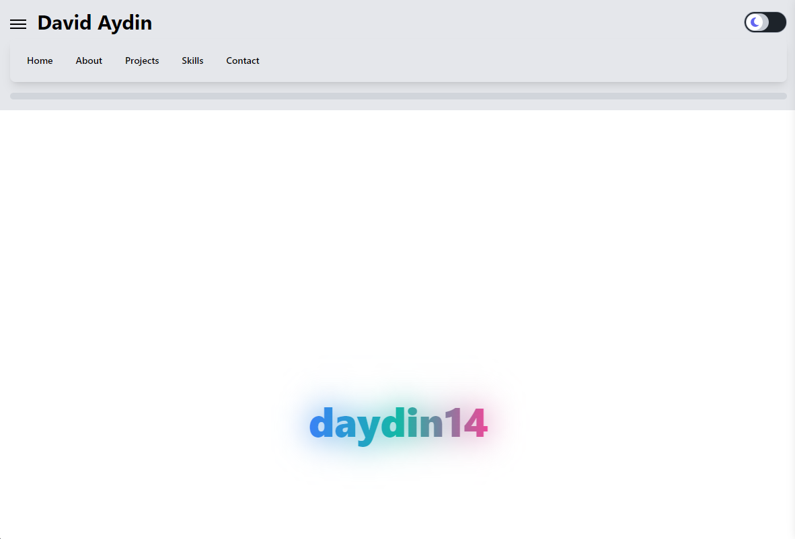
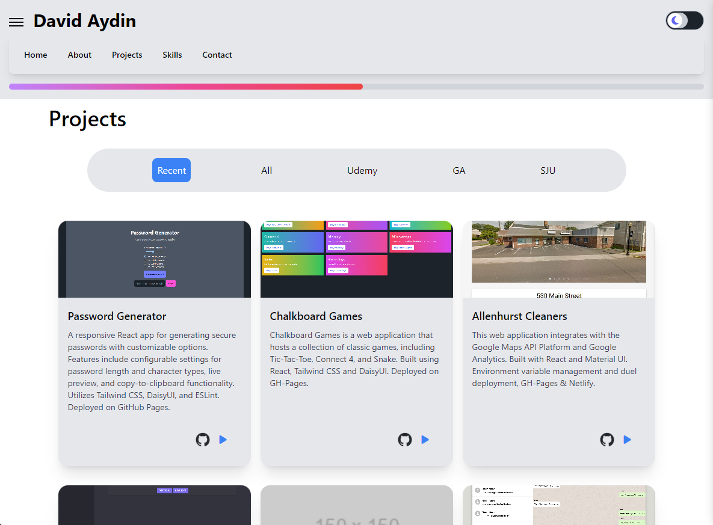

# daydin14.github.io


- Deployed to GH-Pages: https://daydin14.github.io/

## Table of Contents

- [Getting Started](#getting-started)
- [Features](#features)
- [Technologies Used](#technologies-used)
- [Screenshots](#screenshots)
- [Project Structure](#project-structure)
- [Deployment on GitHub Pages](#deployment-on-github-pages)

## Getting Started

To get started with the project, follow these steps:

1. **Fork the repository**: Click the "Fork" button at the top right of this repository to create a copy of the repository in your GitHub account.
2. **Clone the repository**: Clone the forked repository to your local machine using the following command:
   ```bash
   git clone https://github.com/<your-username>/daydin14.github.io.git
   ```
3. **Navigate to the project directory**: Change into the project directory:
   ```bash
   cd portfolio
   ```
4. **Open with VS Code**: Using the terminal, after you've changed directory into the project:
   ```bash
   code .
   //Daves Side Note: '.' is similar to saying, code "current directory"
   ```
5. **Install dependencies**: Install the required dependencies using npm:
   ```bash
   npm install || npm i
   ```
6. **Start the development server**: Start the development server to run the application locally:
   ```bash
   npm start
   ```

## Features

- **Single-Page Application**: Built using React, providing a smooth and seamless user experience.
- **Responsive Design**: Ensures the application works well on both desktop and mobile devices.
- **Theme Toggle**: Allows users to switch between light and dark themes for better accessibility and user experience.
- **Progress Bar**: Displays a progress bar to indicate page status or length down the page.
- **Google Maps Integration**: Embeds Google Maps for county-based location features and services.
- **Google Analytics**: Tracks and reports website traffic for better insights and analytics.
- **Font Awesome and React Icons**: Utilizes Font Awesome and React Icons for a wide range of icons and symbols.
- **Contact Form**: Includes a contact form for users to get in touch easily.
- **Gradients**: Implements gradient backgrounds and elements for a modern and visually appealing design.

## Technologies Used

### IDEs/Editors

- **VS Code**: A powerful, lightweight code editor with built-in support for JavaScript, TypeScript, and Node.js.

### Version Control

- **Git**: A distributed version control system for tracking changes in source code.
- **GitHub**: A web-based platform for version control and collaboration.

### Languages

- **JavaScript (JS)**: The main programming language used for building the application.
- **HTML**: Used for structuring the web pages.
- **CSS**: Used for styling the web pages.
- **Markdown (MD)**: Used for writing documentation.

### Frameworks, Platforms, and Libraries

- **NPM**: A package manager for JavaScript, used to install dependencies.
- **React**: A JavaScript library for building user interfaces.
- **React Router**: A library for routing in React applications.
- **react-ga4**: A library for integrating Google Analytics 4 with React applications.
- **react-gtm-module**: A library for integrating Google Tag Manager with React applications.

### CSS Frameworks and Tools

- **Tailwind CSS:** A utility-first CSS framework for rapid UI development.
- **DaisyUI:** A plugin for Tailwind CSS that provides pre-designed components.
- **PostCSS:** A tool for transforming CSS with JavaScript plugins.
- **Autoprefixer:** A PostCSS plugin to parse CSS and add vendor prefixes.

### Linting and Formatting

- **ESLint:** A tool for identifying and fixing problems in JavaScript code.
- **eslint-plugin-react:** An ESLint plugin for React-specific linting rules.
- **@eslint/js:** ESLint's built-in JavaScript rules.
- **globals:** A library of global variables for ESLint.

## Screenshots




## Project Structure

```
app/
├── public/
│   └── ...
├── src/
│   ├── assets/
│   │   ├── images/
│   │   │   └── ...
│   │   ├── styles/
│   │   │   └── ...
│   ├── components/
│   │   │   └── ...
│   ├── constants/
│   │   │   └── ...
│   ├── contexts/
│   │   │   └── ...
│   ├── hooks/
│   │   │   └── ...
│   ├── pages/
│   │   │   └── ...
│   ├── tests/
│   │   │   └── ...
│   ├── utils/
│   │   │   └── ...
│   ├── App.js
│   ├── AppRoutes.js
│   └── index.js
├── .gitignore
├── README.md
├── .eslint.config.mjs
├── package-lock.json
├── package.json
├── postcss.config.js
└── tailwind.config.js
```

## Deployment on GitHub Pages

This project uses the gh-pages node package to deploy the application to GitHub Pages.
Follow these steps to deploy your application:

1. **Install gh-pages**: Install the gh-pages package as a development dependency:
   ```bash
   npm install gh-pages --save-dev
   ```
2. **Update package.json**: Add the following scripts to your package.json file:
   ```json
   "scripts": {
        <!--
            ... {Other existing scripts} i.e.
            "start": "react-scripts start",
        -->
       "predeploy": "npm run build",
       "deploy": "gh-pages -d build",
   }
   ```
3. **Add homepage field**: Add the homepage field to your package.json file with the URL of your GitHub Pages site:

   ```json
   "homepage": "https://<your-username>.github.io/"

    - If you want to host a project in a subdirectory,
        update the "homepage" field to include the project name
        (e.g., `https://<your-username>.github.io/project-name`).
    - Be sure to change the url within the "homepage" json text to your GitHub username
   ```

4. **Deploy the application**: Run the deploy script to build and deploy the application to GitHub Pages:
   ```bash
   npm run deploy
   ```
